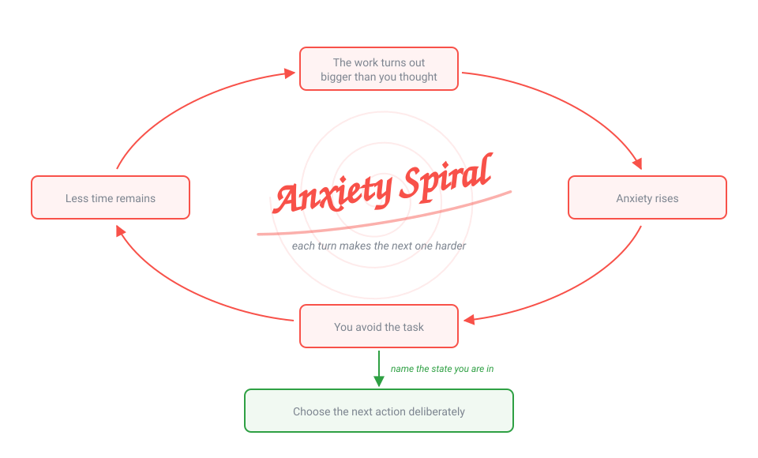
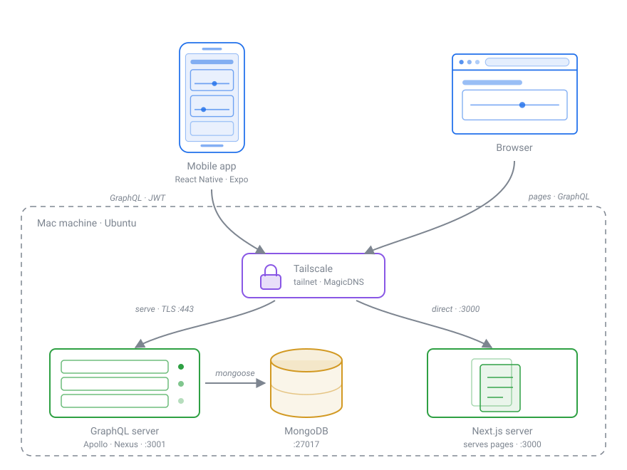

<h1></h1>

A mindfulness tool that helps users visualize a mental framework for how their motivation affects their emotions (and vice versa). Track a goal, place it on the scale between *chasing success* and *avoiding failure*, and watch how that position lines up with how you actually feel. Available on the web and as an Android app, sharing one GraphQL backend.

**[Read the guide to the framework →](./guide.md)**

## What problem does this solve?

***This tool prevents your emotions from getting in the way of your goals through self-awareness.***

A goal you care about starts to slip. The work turns out to be larger than you estimated, anxiety rises, and the instinctive response to anxiety is avoidance. Avoiding it costs time, which makes the work larger still — and the loop tightens with every pass.

<div align="center">
  
</div>

That spiral can run for hours and end in abandoning the goal entirely — not because it was unachievable, but because the emotional state made action hardest at the moment action mattered most.

The way out is noticing where you are while it is happening. Motivation is not on or off; it runs along a spectrum from *chasing success* to *avoiding failure*, and your position on it predicts how the next action will feel. Once you can name the state you are in, you can pick the action that moves you along the spectrum instead of reacting to whichever emotion is loudest.

The Motivation Scale is a framework for doing exactly that. This tool tracks your goals against it, so the state you are in is something you can see rather than something you reconstruct afterwards.

## Tech Stack

| Surface | Stack |
| ------- | ----- |
| **Website** | Next.js (App Router) · React · Apollo Client · SCSS · TypeScript |
| **Mobile** | React Native · Expo · Apollo Client · React Navigation · EAS Build |
| **Server** | Node · TypeScript · Apollo Server · Nexus (code-first schema) · Mongoose · JWT · Jest |
| **Data** | MongoDB |
| **Infra** | Docker Compose · Tailscale |

## Architecture

<p align="center">
  
</p>

The outlined box is a single machine on the tailnet, reached by its MagicDNS name. The GraphQL server and MongoDB run there as containers via `compose.yaml`; the Next.js server runs alongside them. Only the GraphQL API is fronted by `tailscale serve` with TLS on :443 — the Next.js server is reached directly on :3000.

The browser sits outside that box — it's the visitor's own machine. It downloads pages from the Next.js server, then calls the GraphQL API from JavaScript, exactly as the mobile app does. Both clients therefore talk to the same GraphQL endpoint: the server signs a JWT on login/signup, every subsequent request carries it in the `Authorization` header, and the server verifies it in the Apollo context before any resolver runs.

**Data model** — `User` (id, email, hashed password) · `Scale` (id, userId, goal, slider value, chasing-success + avoiding-failure descriptions) · `ScaleOrder` (userId, scaleIds[])

## Repository layout

```
server/     GraphQL API — Nexus schema in src/graphql, Mongoose models in src/models
website/    Next.js app — App Router pages in src/app, queries in src/queries
mobile/     Expo app — screens in screens/, shared queries + context in utils/
compose.yaml  Server + MongoDB for local development
```

## Local Setup

```
git clone https://github.com/abdullahmorrison/motivation-scale.git
```

**Prerequisites:** [Docker](https://docs.docker.com/desktop/) and Node.js. For mobile, also [Android Studio](https://developer.android.com/studio/install) and a [React Native / Expo environment](https://reactnative.dev/docs/set-up-your-environment).

### Environment variables

| File | Variable | Purpose |
| ---- | -------- | ------- |
| `.env` | `JWT_SECRET` | Signs and verifies auth tokens. Compose substitutes `${JWT_SECRET}` from this file, so it must exist — copy `.env.local` to create it. |
| `website/.env.local` | `NEXT_PUBLIC_SERVER_URL` | GraphQL endpoint the website calls |
| `mobile/.env.local` | `EXPO_PUBLIC_SERVER_URL` | GraphQL endpoint the app calls when run locally |
| `mobile/eas.json` | `EXPO_PUBLIC_SERVER_URL` | Same, but per EAS build profile — this is what shipped builds use |

`DB_NAME` and `DB_CONNECTION` are set for you in `compose.yaml`.

### Server & DB

```
cp .env.local .env
docker compose up
```

The GraphQL server comes up on **:3001** and MongoDB on **:27017**, with data persisted in the `db_data` volume. Open <http://localhost:3001> for the GraphQL Playground. Run the test suite from `/server` with `npm test`.

> [!NOTE]
> You can view the data using [MongoDB Compass](https://www.mongodb.com/docs/compass/current/install/).

### Website

From `/website`, `npm install && npm run dev`. Runs on **:3000** and points at `NEXT_PUBLIC_SERVER_URL`.

### Mobile

From `/mobile`, `npm install && npm start`.

> [!IMPORTANT]
> `npm start` launches with `--dev-client`, so it needs a development build installed on the device — Expo Go won't work. Build one with `eas build --profile development`, or run `npm run android` to build and install locally.

Note that `localhost` in `mobile/.env.local` refers to the phone itself, not your computer. Point it at a hostname the device can actually reach.

## Deployment

The stack runs on one machine published to a tailnet, so no ports are exposed to the public internet. Beyond the setup above, two things are easy to get wrong:

- `sudo tailscale serve --bg --https=443 3001` puts TLS in front of the GraphQL API, but only if HTTPS certificates are enabled for the tailnet under [DNS in the admin console](https://login.tailscale.com/admin/dns). Swap `serve` for `funnel` to reach it from outside the tailnet.
- `EXPO_PUBLIC_*` values are inlined at bundle time, so changing the URL in `mobile/eas.json` requires a new build — not an OTA update.

## Contributing

See [CONTRIBUTING.md](./CONTRIBUTING.md).
